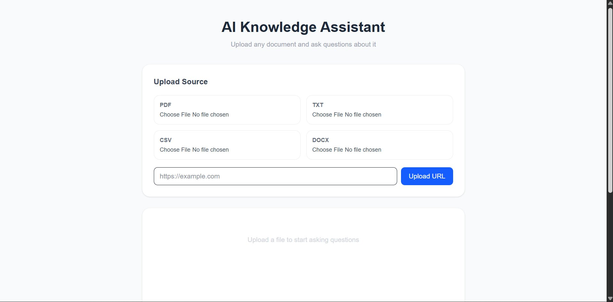

# 🤙🏽 AI Knowledge Assistant

> Turn any document into a smart chatbot — with citations, memory, and hybrid search.

[](https://knowledge-frontend-ten.vercel.app)
[](https://t.me/7asaneen_bot)
[](https://khaled0fouad000-knowledge-assistant-api.hf.space)
[](https://python.org)
[](https://fastapi.tiangolo.com)
[](LICENSE)

---

## Preview



---

## What Is This?

**AI Knowledge Assistant** is a production-ready RAG (Retrieval-Augmented Generation) system that ingests documents from multiple sources, builds a searchable knowledge base, and answers questions with accurate, cited responses.

Upload a PDF, paste a URL, or send a CSV — then ask anything. The assistant retrieves the most relevant chunks using **hybrid search** (semantic + keyword), and generates answers grounded in your document — not hallucinated.

Available as a **web app**, a **Telegram bot**, and a **REST API**.

---

## Features

- 🧠 **Hybrid RAG Search** — Combines FAISS semantic search with BM25 keyword retrieval for higher accuracy
- 📄 **Multi-source Ingestion** — PDF, TXT, CSV, DOCX, and URLs
- 💬 **Conversation Memory** — Maintains context across multiple turns per session
- 📎 **Page-level Citations** — Every answer references its source page or chunk
- 🤖 **Telegram Bot** — Chat with your documents directly from Telegram
- 🌐 **Next.js Frontend** — Clean, responsive web interface
- ⚡ **Fast Inference** — Powered by Groq (LLaMA 3.3 70B) for near-instant responses
- 🔄 **Session Management** — Independent conversation history per user/session

---

## How It Works

```
User (Web / Telegram)
        ↓
  Upload Document
        ↓
  Text Extraction  ──→  Chunking  ──→  Embeddings  ──→  FAISS Index
                                                              ↓
  User Question  ──→  Hybrid Retrieval (FAISS + BM25)
                                ↓
                      Top K Relevant Chunks
                                ↓
                  Groq LLM (LLaMA 3.3 70B) + Chat History
                                ↓
                    Answer with Page Citations
```

### Why Hybrid Search?

Pure semantic search misses exact keyword matches. Pure BM25 misses conceptual similarity. Combining both covers more ground — the system deduplicates results and returns the best chunks from either approach.

---

## 🗂️ Project Structure

```
knowledge-assistant/
│
├── main.py             # FastAPI backend — all endpoints, RAG logic, session management
├── bot.py              # Telegram bot — file handling, URL ingestion, message routing
├── app.py              # Streamlit UI — lightweight web interface
│
├── requirements.txt    # Python dependencies
├── Dockerfile          # Container configuration
├── Procfile            # Process definitions
│
└── README.md
```

**Frontend (separate repo):**

```
knowledge-frontend/
│
└── app/
    └── page.tsx        # Next.js chat interface — file upload, URL input, chat UI
```

---

## ⚙️ Setup & Run

### 1. Clone the repository

```bash
git clone https://github.com/Khaled-fouad0/knowledge-assistant.git
cd knowledge-assistant
```

### 2. Install dependencies

```bash
pip install -r requirements.txt
```

### 3. Configure environment

Create a `.env` file:

```env
GROQ_API_KEY=your_groq_key_here
TELEGRAM_TOKEN=your_telegram_token_here
```

Get a free Groq key at [console.groq.com](https://console.groq.com) — no credit card required.

### 4. Run the backend

```bash
uvicorn main:app --reload
```

API available at `http://localhost:8000`  
Interactive docs at `http://localhost:8000/docs`

### 5. Run the Telegram bot (optional)

```bash
python bot.py
```

### 6. Run the Streamlit UI (optional)

```bash
streamlit run app.py
```

---

## 🔌 API Reference

### Upload Endpoints

| Method | Endpoint | Description |
|--------|----------|-------------|
| `POST` | `/upload` | Upload a PDF file |
| `POST` | `/upload_text` | Upload a TXT file |
| `POST` | `/upload_csv` | Upload a CSV file |
| `POST` | `/upload_docx` | Upload a DOCX file |
| `POST` | `/upload_url` | Ingest content from a URL |

**Example — Upload PDF:**
```bash
curl -X POST http://localhost:8000/upload \
  -F "file=@document.pdf"
```

**Response:**
```json
{
  "status": "success",
  "pages": 12,
  "chunks": 47,
  "filename": "document.pdf"
}
```

---

### Conversation Endpoints

#### `POST /ask`

Ask a question about the uploaded document.

**Request:**
```json
{
  "message": "What is the main conclusion of the report?",
  "session_id": "user_123"
}
```

**Response:**
```json
{
  "answer": "According to page 4, the main conclusion is...",
  "session_id": "user_123"
}
```

---

#### `POST /chat`

General chat without document context (no RAG).

**Request:**
```json
{
  "message": "Explain what a vector database is.",
  "session_id": "user_123"
}
```

---

#### `DELETE /reset/{session_id}`

Clear conversation history for a session.

```bash
curl -X DELETE http://localhost:8000/reset/user_123
```

---

#### `POST /upload_url`

Ingest a webpage into the knowledge base.

**Request:**
```json
{
  "url": "https://example.com/article"
}
```

**Response:**
```json
{
  "status": "success",
  "chunks": 31,
  "url": "https://example.com/article"
}
```

---

## 🤖 Telegram Bot Usage

Find the bot at [@7asaneen_bot](https://t.me/7asaneen_bot)

| Action | How |
|--------|-----|
| Upload a file | Send any PDF, TXT, CSV, or DOCX directly |
| Ingest a URL | `/url https://example.com` |
| Ask a question | Just type your message |
| Start / Help | `/start` |

---

## 🧱 Tech Stack

| Layer | Technology |
|-------|------------|
| Backend | FastAPI + Uvicorn |
| LLM | Groq — LLaMA 3.3 70B |
| Embeddings | HuggingFace — `all-MiniLM-L6-v2` |
| Vector Store | FAISS |
| Keyword Search | BM25 (rank-bm25) |
| PDF Parsing | PyMuPDF (fitz) |
| Web Scraping | httpx + BeautifulSoup4 |
| Memory | LangChain `ChatMessageHistory` |
| Frontend | Next.js + Tailwind CSS |
| Alt UI | Streamlit |
| Bot | python-telegram-bot |
| Deployment | Hugging Face Spaces + Vercel |
| Container | Docker |

---

## 🚀 Deployment

### Backend — Hugging Face Spaces (Docker)

The backend is deployed as a Docker Space on Hugging Face.  
The `Dockerfile` and `Procfile` are included in the repo.

Live API: [khaled0fouad000-knowledge-assistant-api.hf.space](https://khaled0fouad000-knowledge-assistant-api.hf.space)

### Frontend — Vercel

The Next.js frontend is deployed on Vercel.

Live app: [knowledge-frontend-ten.vercel.app](https://knowledge-frontend-ten.vercel.app)

---

## 🔒 Notes

- `allow_origins=["*"]` is set for development — restrict in production
- Each session maintains independent conversation history
- The document index is shared globally — designed for single-user or demo use; extend with per-session vectorstores for multi-tenant production use
- LLM responses are grounded in retrieved context only — hallucination is minimized by design

---

## 🚧 Possible Extensions

- [ ] Per-session document isolation (multi-tenant support)
- [ ] Persistent vectorstore (save/load FAISS index to disk)
- [ ] Streaming responses (SSE / token-by-token)
- [ ] Multi-document support (upload and query multiple files at once)
- [ ] Confidence scoring per answer
- [ ] Admin dashboard for session monitoring
- [ ] Authentication layer (API keys or OAuth)
- [ ] Support for more file types (PPTX, XLSX, audio transcripts)

---

## 👤 Author

Built by **Khaled** 🤙🏽

[](https://github.com/Khaled-fouad0)

---

## 📄 License

MIT — free to use, modify, and distribute.
